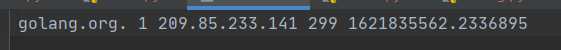

# CACHING DNS SERVER

Принцип работы:

* слушаем 53й udp порт, при получении запроса проверяем,
что это DNS пакет и является запросом (флаг qr = 0).
* проверяем, содержится ли уже данная запись в кеше, если да, то
следующий шаг, а если нет - то делаем запрос к гугловскому
DNS

    1) собираем DNS пакет, устанавливая Recursion Desired,
    и со всеми остальными данными из исходного пакета(имя хоста и тип записи)
    2) отправляем этот пакет на DNS сервер гугла и получаем ответ
    3) помещаем все ресурсные записи в кеш

* отправляем ответ. Формируем секцию ответа. NAME, TYPE - из запроса, TTL, RDATA - из кеша
    1) id - id dns пакета запроса
    2) qr = 1 - отправляем ответ
    3) rd=1, ra=1 - рекурсия
    4) qd - количество записей  (берем из запроса)

## Хранение кеша

Храним имя, тип записи, данные, ttl, время конца ttl

## Пример запуска

    python server.py

## Зависимости

    pip install -r requirements.txt
